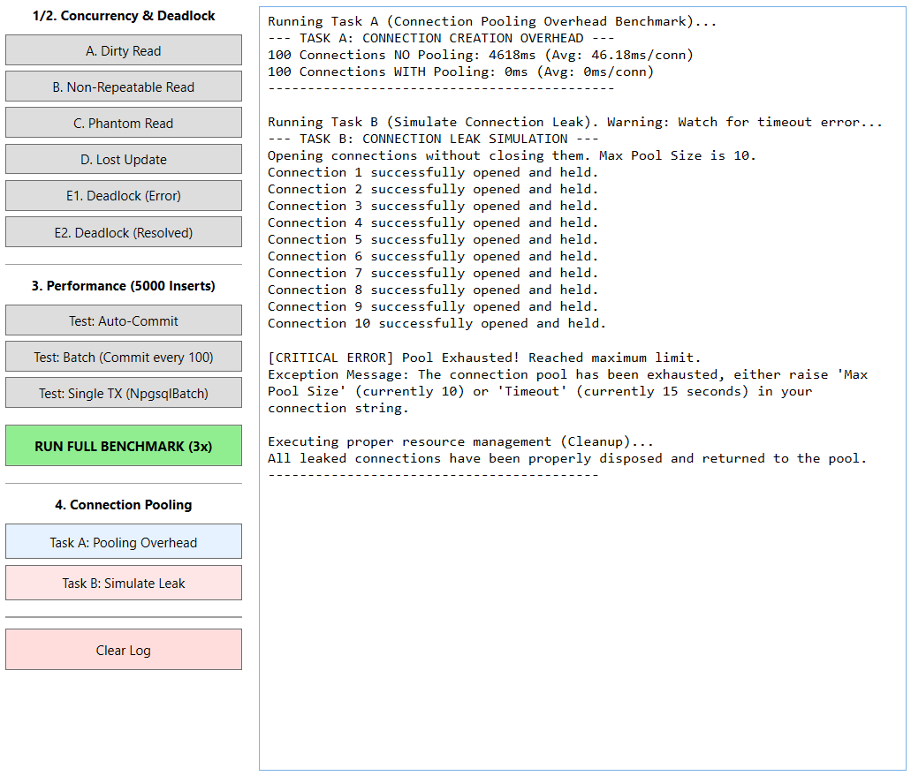

# Raport Laborator : Mutarea pe ORM și Teste de Performanță  - Pooling 

## 1. Entity Framework Core

Până acum, în Laboratorul 1, ne-am chinuit scriind SQL de mână direct în codul de C#. Problema mare era că dacă greșeai o singură literă într-un "SELECT", aplicația crăpa abia când o rulai. Acum, baza de date e "oglindită" direct în clasele noastre. Practic, EF Core se ocupă să traducă tot ce scriem noi în C# în comenzi SQL pe care le trimite la Postgres.

Clasele Author, Book și Category au fost modificate sa foloseasca atribute ca [Key] pentru a-i spune bazei de date care sunt ID-urile și cum se leagă tabelele între ele. 
* Pentru relația de tip 1:N (un autor cu mai multe cărți), am pus o listă virtuală de cărți în clasa autorului. 
* Pentru relația M:N (cărți și categorii), EF Core e destul de deștept să facă singur tabelul de legătură în spate, deci noi doar îi spunem că o carte poate avea mai multe genuri.

O diferența uriașă dintre LINQ si SQL Manual consta in numarul de linii de cod scrise. În loc să deschidem conexiuni, să creăm comenzi și să citim rând cu rând din baza de date ca niște roboței, acum scriem o singură linie de cod care face totul. Asta ne scapă de mult "boilerplate code" (cod repetitiv și plictisitor) și face totul mult mai sigur împotriva atacurilor de tip SQL Injection.

## 2. Lazy vs Eager Loading

După ce am mutat totul pe EF Core, am învățat că poți să aduci datele din baza de date în două moduri, în funcție de cât de disperat ești după intreaga informatie. În aplicația noastră, am ales să le combinăm pentru a avea și viteză, și consum mic de memorie:

* **Lazy Loading (Modul implicit în aplicație)**: Am configurat relația dintre autor și cărți să fie leneșă prin pachetul de Proxies. Asta înseamnă că, de obicei, aplicația aduce doar datele de bază. Dacă mai târziu te trezești că vrei să vezi și categoriile unei cărți, abia atunci EF Core face un drum nou la baza de date ca să le ia. E super pentru a nu încărca memoria degeaba cu detalii despre care utilizatorul nu e interesat in acel moment. 
* **Eager Loading (Implementat special pentru lista de cărți)**: Deși Lazy e modul de bază, am creat un scenariu special unde forțăm încărcarea rapidă. În metoda "GetBooksByAuthor", am folosit ".Include()" ca să-i spunem bazei de date: "Băi, când îmi aduci cărțile unui autor, adu-mi și categoriile lor din prima!". Am făcut asta pentru că în tabelul de cărți vrem să vedem totul instant, fără să așteptăm după 100 de interogări separate care ar încetini imaginea.

## 3. Connection Pooling

Baza de date e destul de "greoaie" când trebuie să deschidă o conexiune nouă: trebuie să verifice cine ești, dacă ai parola bună, să aloce memorie etc. Connection Pooling-ul e ca un "rezervor" de conexiuni care stau deja deschise și așteaptă să fie folosite. În loc să pierzi timp creând una nouă, doar întinzi mâna și iei una din pool.

### Sarcina A: Testul de viteză (Overhead)
Am implementat un test în care am cerut 100 de conexiuni una după alta:
* **Fără Pooling**: A durat cam **3.5 secunde**. Se simțea lag-ul clar, de parcă aplicația se gândea de fiecare dată ce are de făcut.
* **Cu Pooling**: A durat **0 ms**. Efectiv n-a mai durat nimic, pentru că aplicația n-a mai construit nicio conexiune, doar le-a reciclat pe cele din memorie.

### Sarcina B: Testul de "Crash" (Scurgeri de conexiuni)
Aici am simulat ce se întâmplă când un programator uită să închidă conexiunea (adică uită să folosească blocul "using"). 
* Am pus o limită la pool de **10 conexiuni**.
* Am încercat să deschidem **15 conexiuni** fără să le dăm drumul înapoi în "rezervor".
* **Rezultat**: Aplicația a deschis primele 10 fără probleme, dar la a 11-a a înghețat. A stat vreo 15 secunde să aștepte să se elibereze ceva, n-a primit nimic, și a dat o eroare mare de "Timeout". Asta ne-a învățat că dacă nu ești atent și "uiți robinetul deschis", blochezi toată aplicația.

  

## 4. Gestionarea Tranzacțiilor

Pe lângă faptul că scriem cod mai puțin, ORM-ul ne ajută enorm și la capitolul siguranță prin tranzacții. Înainte, dacă voiai să adaugi o carte care are și 3 categorii, trebuia să te rogi să nu pice curentul sau netul la jumătatea procesului, ca să nu rămâi cu date pe jumătate scrise.

Acum am folosit "BeginTransaction()". E ca o plasă de siguranță: ori se salvează tot (cartea în tabelul ei și legăturile cu categoriile în tabelul de joncțiune), ori nu se salvează absolut nimic dacă apare vreo eroare. Asta ne garantează că baza noastră de date rămâne mereu curată și nu avem "date orfane".

## 5. Configurația Externalizată (appsettings.json)

O regulă de aur pe care am învățat-o este să nu lași niciodată parola bazei de date scrisă direct în codul C# (hardcoded). E periculos și greu de modificat. Am mutat tot ce înseamnă conexiune și setări de pooling într-un fișier separat numit `appsettings.json`. Acum, dacă vrem să schimbăm parola sau să mărim numărul de conexiuni din pool, intrăm în fișierul ăla de text, modificăm o cifră și gata. Nu mai trebuie să recompilăm toată aplicația. E mult mai profesionist și mai sigur așa.

## 6. Puncte Bonus: Migrations și Logging

* **Generarea schemei (Migrations)**: Cel mai tare lucru e că nu am mai stat să creăm tabelele de mână în pgAdmin. EF Core s-a uitat la clasele noastre de C# și a generat singur tabelele, cheile primare și relațiile. Dacă adăugăm o coloană nouă în cod, dăm o comandă și baza de date se actualizează singură.
* **Logging SQL**: Am activat o funcție care ne "toarnă" în Consolă exact ce face aplicația pe fundal. E super util să vezi cum codul tău C# se transformă în interogări SQL reale. Așa am putut să verificăm dacă Eager Loading-ul chiar face JOIN-ul pe care l-am cerut.

## 7. Concluzii

Trecerea la ORM a fost un pic grea la început până am înțeles cum se fac legăturile si pana am rezolvat problemele de dependenta in mediul de dezvoltare, dar beneficiile sunt uriașe:
1.  **Viteză de dezvoltare**: Scriem cod mult mai repede și mai curat.
2.  **Performanță**: Datorită Connection Pooling-ului, aplicația se mișcă instant, chiar și când facem sute de cereri.
3.  **Mai puține bug-uri**: Visual Studio ne prinde greșelile de scriere înainte să rulăm codul.
