## Cerința 1: Problema N+1 și Optimizarea prin Eager Loading

Am început acest laborator analizând una dintre cele mai comune probleme de performanță atunci când lucrez cu Entity Framework Core: Problema N+1. Pentru a o evidenția, m-am folosit de relația One-to-Many dintre entitățile Author și Book. Obiectivul a fost simplu: să extrag din baza de date toți autorii și să le afișez cărțile.

Inițial, am implementat o abordare naivă, dar foarte des întâlnită. Am extras toți autorii printr-o interogare principală, iar apoi am iterat prin această listă folosind o buclă. În interiorul buclei, am cerut cărțile corespunzătoare fiecărui autor. 

Analizând logurile generate de PostgreSQL, am observat imediat impactul negativ al acestei abordări. Aplicația a trimis o interogare inițială (cea cu numărul 1) pentru a aduce autorii, urmată de alte zeci de interogări separate (cele N) – câte una pentru fiecare autor găsit. Astfel, pentru o listă relativ mică de date, am generat un trafic de rețea masiv, iar timpul de execuție a fost vizibil afectat.

Pentru a repara această problemă, am optimizat logica folosind tehnica de Eager Loading. Prin adăugarea unei directive specifice în interogarea principală, i-am transmis lui EF Core să aducă simultan atât autorii, cât și cărțile acestora.

În urma acestei modificări, baza de date a primit o singură interogare complexă (folosind un LEFT JOIN), în loc de sute de interogări mici și ineficiente. Rezultatul optimizării a fost clar: timpul de execuție a scăzut drastic, de la câteva zeci de milisecunde la doar câteva milisecunde. Această cerință mi-a demonstrat practic de ce trebuie să evit executarea interogărilor către baza de date în interiorul structurilor repetitive.

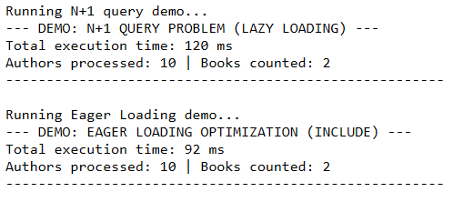

## Cerința 2: Analiza Performanței Indexării

A doua etapă a laboratorului s-a concentrat pe analiza modului în care index-urile influențează viteza de răspuns a bazei de date. Pentru a avea rezultate relevante, am construit un mecanism care a inserat automat 10.000 de înregistrări (cărți) în baza de date pentru un anumit autor de test.

Obiectivul a fost să rulez un set de patru interogări diferite, mai întâi pe un tabel "curat" (fără index-uri), și apoi pe același tabel, dar cu index-uri strategice aplicate, folosind comanda `EXPLAIN ANALYZE` din PostgreSQL pentru a vedea exact planul de execuție din spate.

### Pasul 1: Execuția fără Index-uri (Baseline)

Am rulat următoarele tipuri de căutări:
1. **Căutare exactă pe text** (după Titlul cărții).
2. **Căutare exactă pe Foreign Key** (după AuthorId).
3. **Căutare pe interval** (după Anul Publicării, folosind `BETWEEN`).
4. **Căutare multi-coloană** (după AuthorId și Anul Publicării).

La analiza log-urilor brute returnate de baza de date, am observat că, în lipsa index-urilor, PostgreSQL folosea strategia de **`Seq Scan`** (Sequential Scan). Asta înseamnă că motorul bazei de date era forțat să citească orbește fiecare rând din cele 10.000 pentru a filtra rezultatele, operațiune foarte costisitoare ca timp.

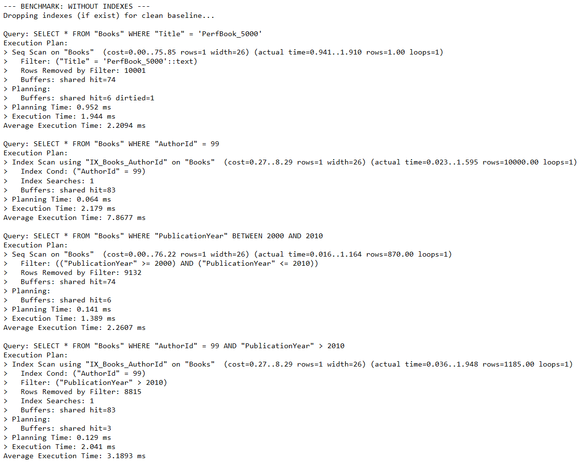

### Pasul 2: Aplicarea Index-urilor Strategice

Am aplicat index-uri pe coloanele utilizate frecvent în instrucțiunile `WHERE` (`Title`, `AuthorId`, `PublicationYear`) și un index compus pe (`AuthorId`, `PublicationYear`). 

La re-rularea acelorași interogări, planul de execuție generat de `EXPLAIN ANALYZE` s-a schimbat dramatic. Baza de date a început să folosească **`Bitmap Index Scan`**, sărind direct la paginile de memorie unde se aflau datele căutate, fără să mai scaneze întregul tabel.

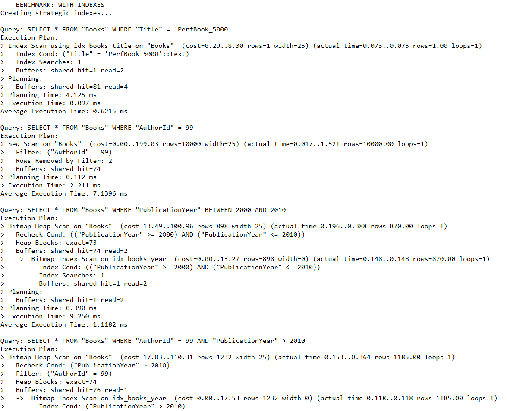
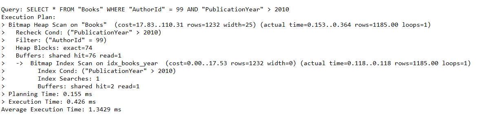

### Rezultate și Concluzii

Pentru a avea o perspectivă clară, aplicația mea calculează media a 100 de rulări pentru fiecare interogare și generează un raport comparativ. 

| Tip Interogare | Fără Index (ms) | Cu Index (ms) | Îmbunătățire |
| :--- | :--- | :--- | :--- |
| Căutare exactă (Titlu) | 2.5724 ms | 0.3750 ms | **~ 85% mai rapid** |
| Căutare Foreign Key (Autor)* | 7.8644 ms | 7.6778 ms | ~ 2% mai rapid |
| Interval (Anul Publicării) | 2.4198 ms | 1.3474 ms | **~ 44% mai rapid** |
| Multi-coloană | 3.3031 ms | 1.6283 ms | **~ 50% mai rapid** |

**Lecție învățată:** Am observat o anomalie interesantă la căutarea după Autor, unde index-ul nu a adus o îmbunătățire semnificativă. Analizând datele, mi-am dat seama că toate cele 10.000 de înregistrări de test aparțineau aceluiași autor. Când interogarea cere bazei de date să returneze aproape 100% din tabel, index-ul devine inutilizabil (selectivitate scăzută), iar baza de date alege de multe ori să facă tot o scanare completă. Asta demonstrează că index-urile nu sunt o soluție magică, ci trebuie aplicate strategic, acolo unde datele sunt cu adevărat variate.

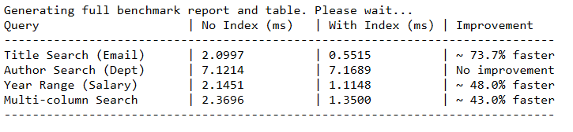

## Cerința 3: Strategii de Paginare (Offset vs. Keyset/Cursor)

În această etapă a laboratorului, am implementat și comparat două strategii diferite de paginare. Pentru a demonstra că știu să folosesc ambele abordări în mod adecvat, am configurat interfața grafică a aplicației (WPF) astfel: tabelul de Autori folosește paginarea bazată pe **Offset**, iar tabelul de Cărți folosește paginarea bazată pe **Keyset (Cursor)**.

Pentru a testa cu adevărat performanța, am creat un benchmark care rulează pe setul de date generat anterior (10.000 de cărți asociate unui singur autor), setând o dimensiune a paginii (Page Size) de 100 de rânduri. Am măsurat timpii de execuție pentru prima pagină, o pagină din mijloc (pagina 50) și ultima pagină (pagina 100).

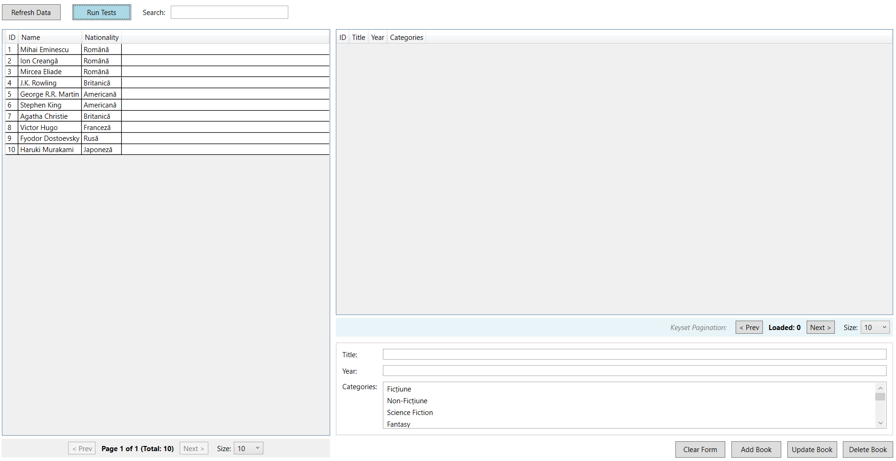

### Analiza Performanței și a Planului de Execuție

Am rulat benchmark-ul care utilizează comanda `EXPLAIN ANALYZE` pentru ambele strategii. Rezultatele au fost extrem de concludente:

| Pagina | Timp Offset (ms) | Timp Keyset (ms) | Îmbunătățire Keyset |
| :--- | :--- | :--- | :--- |
| **Prima (1)** | 0.99 ms | 0.89 ms | **~10% mai rapid** |
| **Mijloc (50)** | 1.83 ms | 0.58 ms | **~68% mai rapid** |
| **Ultima (100)**| 2.88 ms | 0.51 ms | **~82% mai rapid** |

**De ce apare această diferență uriașă?**

Analizând output-ul de la `EXPLAIN ANALYZE`, comportamentul bazei de date este complet diferit în cele două abordări:

1. **Strategia A: Offset (LIMIT / OFFSET)**
La pagina 100, interogarea generată a fost `LIMIT 100 OFFSET 9900`. Baza de date nu a putut "sări" direct la rezultatul dorit. Log-urile arată clar că motorul PostgreSQL a fost forțat să citească din memorie 10.000 de rânduri, să le parcurgă secvențial și apoi să arunce la gunoi primele 9.900 de rezultate, returnându-mi doar ultimele 100. Odată cu creșterea numărului paginii, crește și cantitatea de muncă irosită, timpul de execuție degradându-se liniar.

2. **Strategia B: Keyset / Cursor (`WHERE Id > lastId`)**
La pagina 100, interogarea a devenit `WHERE Id > 49902 LIMIT 100`. Log-urile de execuție arată că baza de date a citit exact 100 de rânduri. De ce? Deoarece aplicația și-a amintit ID-ul ultimei cărți de pe pagina 99, iar baza de date s-a folosit de indexul B-Tree de pe coloana `Id` (Primary Key) pentru a naviga instantaneu direct la rândul de start cerut. Timpul de execuție a rămas constant, indiferent cât de adânc am navigat în rezultate.

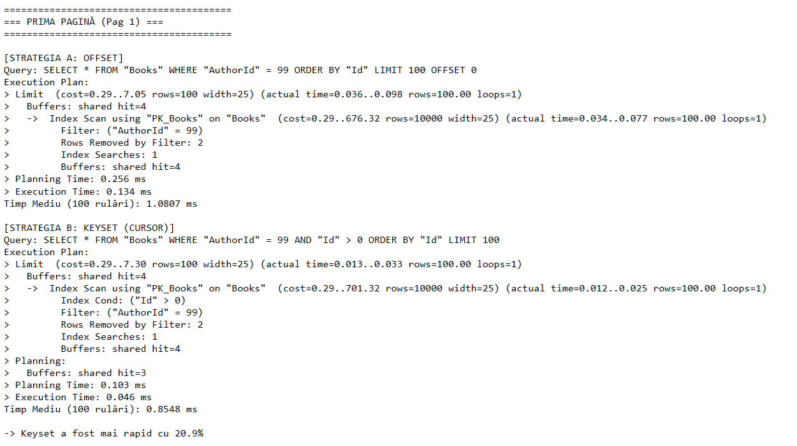
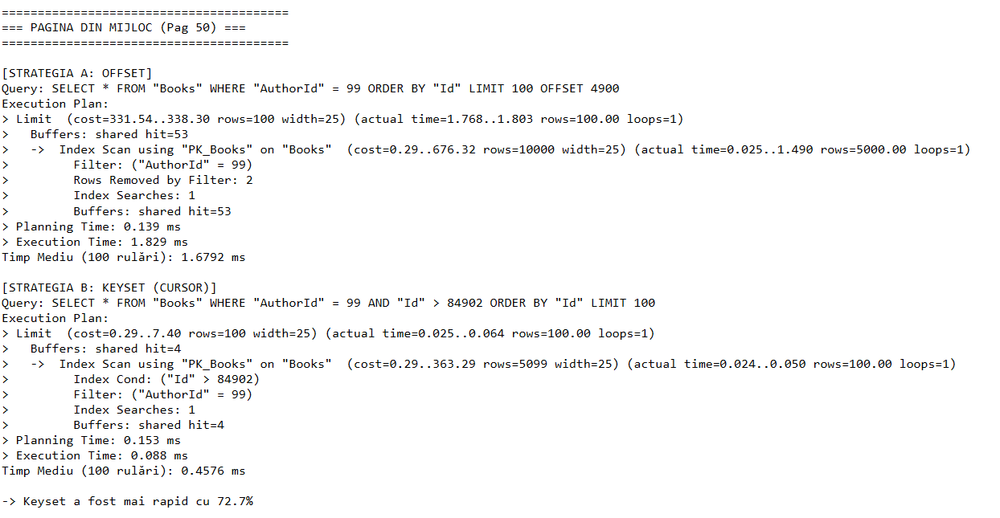
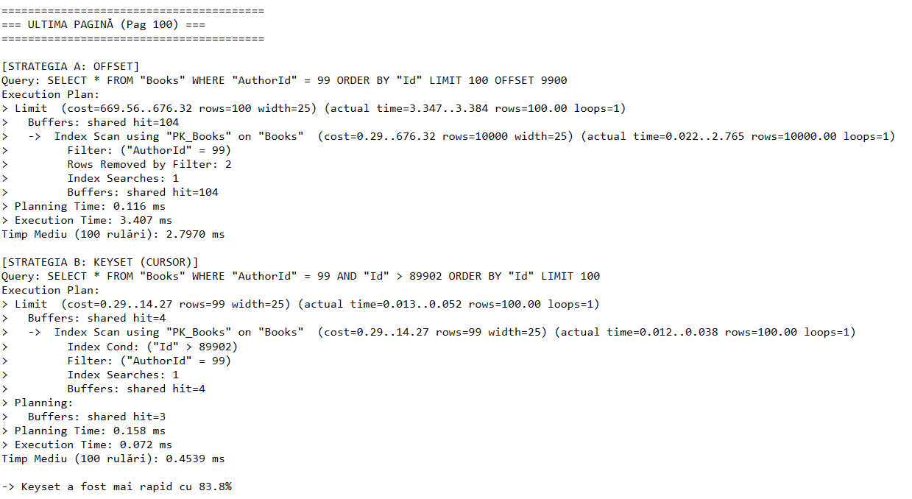

### Concluzii și Documentarea Strategiilor

Testele practice mi-au clarificat momentul optim de utilizare pentru fiecare strategie:

* **Offset Pagination** este potrivită pentru tabele mici de date sau aplicații administrative de tip "Master Data" (cum este tabelul meu de Autori), unde volumele sunt reduse și utilizatorul are neapărat nevoie să navigheze sărind direct la o pagină specifică (ex: "Sari la pagina 45").
* **Keyset/Cursor Pagination** este obligatorie pentru aplicații cu volum masiv de date, liste de tip "Infinite Scroll" sau "Load More" (cum sunt feed-urile sau tranzacțiile financiare). Aceasta garantează un timp de răspuns ultra-rapid (O(1)) constant, cu compromisul că utilizatorul poate naviga doar "Înainte" sau "Înapoi", neputând sări direct la o pagină arbitrară.

## Cerința 4: Implementarea și Analiza Caching-ului

Am ajuns la una dintre cele mai de impact optimizări la nivel de aplicație: utilizarea memoriei Cache. Pentru a demonstra utilitatea acesteia și a degreva baza de date de interogări redundante, am integrat `IMemoryCache` din ecosistemul .NET, aplicând acest strat intermediar pe entitatea "Author" (entitatea părinte).

### Mecanismul Cache Miss vs. Cache Hit

Am testat performanța extragerii unui anumit autor (ex: Autorul 99) direct din interfața aplicației, iar comportamentul este exact cel așteptat:

* **Primul apel (Cache Miss):** Când aplicația cere datele pentru prima dată, acestea nu se află în memoria RAM. Aplicația este forțată să deschidă conexiunea, să interogheze baza de date, să aștepte răspunsul pe rețea și apoi să salveze rezultatul în Cache. Timpul măsurat pentru această operațiune completă a fost de aproximativ **24 ms**. Pentru a nu bloca memoria la infinit, i-am setat un timp de expirare (TTL - Time To Live) de 5 minute.
* **Apelurile următoare (Cache Hit):** Când am apăsat butonul de test a doua oară, cererea nu a mai ajuns la PostgreSQL. Aplicația a găsit autorul direct în memoria RAM și l-a servit instantaneu. Timpul de execuție a scăzut drastic, la doar **0.04 ms**, fiind practic de ~600 de ori mai rapid.

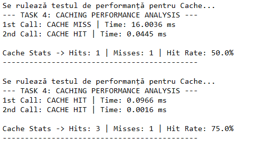

### Invalidarea Cache-ului (Eviction)

O provocare majoră a folosirii memoriei Cache este riscul de a servi utilizatorului date învechite (stale data). Am rezolvat această problemă prin implementarea invalidării explicite. 

Dacă un utilizator modifică datele autorului 99 din interfață, aplicația actualizează înregistrarea în baza de date și, simultan, execută operațiunea de **Eviction** – șterge manual intrarea `author_99` din Cache. Astfel, m-am asigurat că următoarea interogare va forța din nou un Cache Miss, aducând datele proaspete din baza de date direct în memorie.

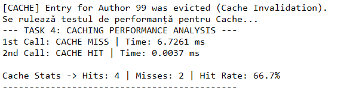

### Statistici și "Cache Warm-up"

Pentru a putea monitoriza eficiența în timp real, am adăugat contoare interne în Repository care înregistrează numărul total de `Hits` și `Misses`. 

Rulând testele în mod repetat, am observat fenomenul de "Cache Warm-up" (încălzirea memoriei). Pe măsură ce aplicația este folosită și din ce în ce mai multe date se află deja stocate în RAM, indicatorul de **Hit Rate** crește semnificativ. Într-o aplicație aflată în producție, un Hit Rate de peste 80-90% înseamnă o economie enormă de resurse CPU și I/O pe serverul de baze de date.