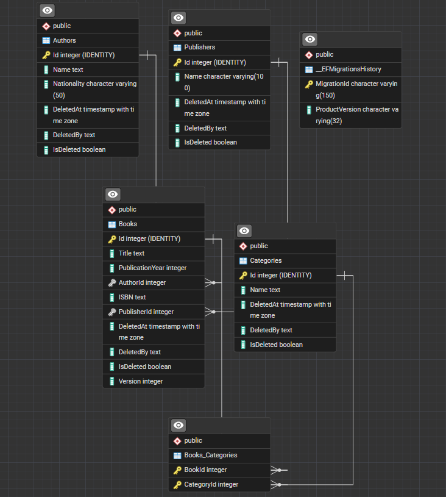
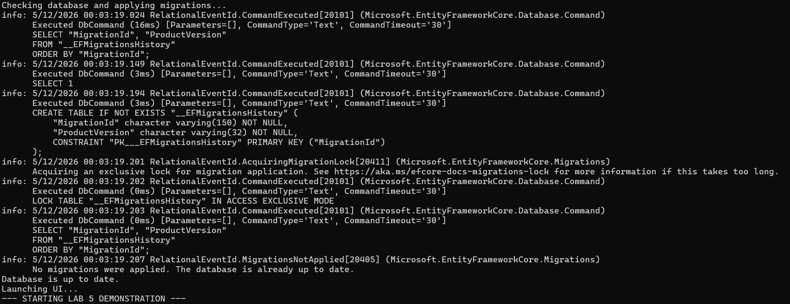
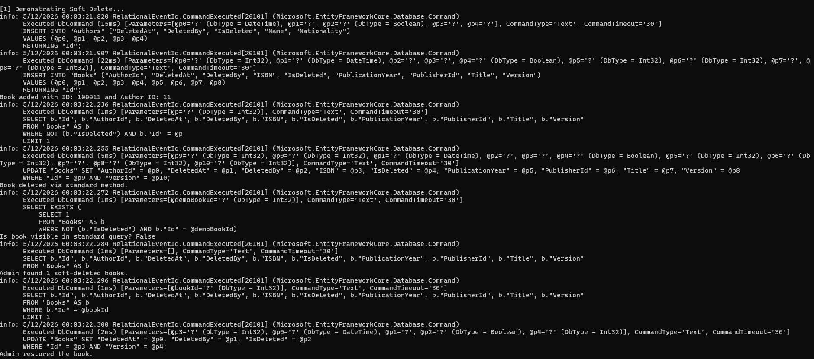
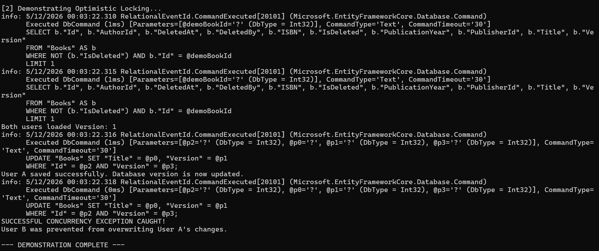

### Cerința 1 - Configurarea Instrumentului de Migrare și Migrarea Inițială (Sarcina A)

**Obiectiv:** Crearea migrării inițiale (baseline) pentru schema existentă a bazei de date (entitățile Authors, Books, Categories și tabela de legătură Books_Categories) folosind instrumentele de migrare Entity Framework Core.

**Pași de execuție:**

1. **Instalarea uneltelor CLI pentru EF Core:**
Pentru a putea gestiona migrările din terminal, am instalat utilitarul dotnet-ef la nivel global rulând comanda:
dotnet tool install --global dotnet-ef

2. **Aplicarea migrării inițiale:**
Fișierul de migrare aferent stării inițiale a proiectului era deja generat în folderul Migrations. Am aplicat această migrare pe baza de date PostgreSQL pentru a o sincroniza și pentru a genera tabela de sistem __EFMigrationsHistory, responsabilă cu urmărirea versiunilor schemei. Comanda utilizată a fost:
dotnet ef database update

3. **Generarea scriptului Baseline:**
Pentru a salva starea curentă a schemei într-un format de migrare/referință, am exportat schema inițială într-un script SQL. Am rulat comanda:
dotnet ef migrations script -o baseline_schema.sql

**Rezultate și Livrabile:**
* Migrarea de bază (baseline) a fost înregistrată cu succes în istoricul Entity Framework.
* Scriptul SQL care conține structura inițială a bazei de date se regăsește în fișierul baseline_schema.sql.

### Cerința 2 - Evoluția Schemei Bazei de Date (Sarcinile B, C, D, E)

**Obiectiv:** Implementarea modificărilor de schemă folosind migrări Entity Framework Core, incluzând adăugarea de coloane, tabele noi, modificarea tipurilor de date și optimizarea performanței prin indecși.

**Pași de execuție:**

1. **Sarcina B: Adăugare coloană nouă**
Am extins entitatea Book adăugând proprietatea ISBN de tip string. Aceasta a generat o migrare de tip ADD COLUMN în tabela Books. S-au permis valori nule pentru a menține compatibilitatea cu înregistrările vechi.

2. **Sarcina C: Adăugare tabel nou**
Am creat entitatea Publisher (Editură) și am stabilit o relație de tip 1-la-mulți (1:N) cu entitatea Book. În clasa Book s-a adăugat cheia străină nullable PublisherId pentru a nu încălca constrângerile datelor existente.

3. **Sarcina D: Modificare coloană existentă**
Am modificat proprietatea Nationality din entitatea Author, adăugând adnotarea MaxLength(50). Migrarea rezultată a modificat tipul coloanei în baza de date PostgreSQL din text în character varying(50).

4. **Sarcina E: Adăugare Index-uri**
Pentru a optimiza interogările, am adăugat indecși folosind Fluent API în clasa LibraryContext. S-a creat un index pe coloana PublicationYear (tabela Books) și pe coloana Name (tabela Authors).

5. **Generarea și Aplicarea Migrării:**
Toate aceste schimbări au fost grupate într-o singură migrare prin comanda:
dotnet ef migrations add SchemaEvolution
Ulterior, schimbările au fost reflectate în baza de date PostgreSQL prin comanda:
dotnet ef database update

**Rezultate și Livrabile:**
* Schema a fost actualizată cu succes, fiind reversibilă prin metoda Down() a clasei de migrare generate.
* Timpii de interogare pe căutările după an și numele autorului sunt optimizați datorită noilor indecși.

### Cerința 3 - Implementare Locking Optimist

**Obiectiv:** Prevenirea pierderii datelor la actualizări concurente folosind abordarea de locking optimist, adecvată pentru un mediu multi-utilizator.

**Pași de execuție:**

1. **Adăugarea coloanei de versiune:**
   Deoarece provider-ul PostgreSQL nu suportă tipul `[Timestamp]` (byte array) la fel ca SQL Server, am adăugat o proprietate de tip `int` numită `Version` pe entitatea `Book`, decorată cu atributul `[ConcurrencyCheck]`.

2. **Migrarea Bazei de Date:**
   Am generat o nouă migrare numită `AddOptimisticLocking` și am aplicat-o pe baza de date. Valoarea implicită pentru înregistrările existente a devenit `0`.

3. **Gestionarea excepțiilor de concurență în Repository:**
   Am modificat metoda `UpdateBookWithCategories` din `LibraryRepository.cs`. Când un update este inițiat:
   * Setăm `OriginalValue` al proprietății `Version` în contextul EF Core pentru a se potrivi cu versiunea adusă din formularul utilizatorului.
   * Incrementăm manual versiunea: `bookToUpdate.Version++`.
   * Când se apelează `SaveChanges()`, EF Core va genera un query de tip `UPDATE Books SET ... WHERE Id = x AND Version = old_version`.
   * Dacă o altă persoană a modificat rândul între timp, rândurile afectate vor fi 0, și EF Core va arunca `DbUpdateConcurrencyException`.

4. **Tratarea Conflictului:**
   Excepția este prinsă în blocul `catch`, tranzacția este anulată (`Rollback`) și este aruncată o eroare personalizată (`InvalidOperationException`) către interfața utilizatorului, cerându-i să reîncarce datele.

**Rezultate:**
Sistemul previne acum actualizările pierdute; utilizatorul B nu poate suprascrie modificările salvate de utilizatorul A dacă a pornit de la aceeași versiune a datelor.

### Cerința 4 - Implementare Ștergere Soft

**Obiectiv:** Înlocuirea ștergerii fizice a datelor cu o abordare logică (soft delete), permițând recuperarea informațiilor și trasabilitatea operațiunilor de ștergere.

**Pași de execuție:**

1. **Adăugarea coloanelor de ștergere logică:**
Am creat clasa de bază AuditableEntity care conține proprietățile IsDeleted, DeletedAt și DeletedBy. Entitățile principale (Book, Author, Category, Publisher) moștenesc acum această clasă, adăugând automat aceste coloane în baza de date prin migrarea AddSoftDelete.

2. **Filtrarea Globală a Interogărilor:**
În clasa LibraryContext, am configurat metoda OnModelCreating pentru a aplica filtre globale (HasQueryFilter) pe entități. Astfel, prin default, interogările standard exclud automat înregistrările unde IsDeleted este true.

3. **Interceptarea Ștergerilor (Soft Delete):**
Am suprascris metoda SaveChanges din DbContext. Orice entitate marcată pentru ștergere (EntityState.Deleted) este transformată automat într-o entitate modificată (EntityState.Modified), setându-i-se proprietatea IsDeleted la true și înregistrând momentul ștergerii (DeletedAt).

4. **Funcționalități de Administrare:**
În repository, am adăugat metode specifice pentru administratori:
- Listarea înregistrărilor șterse: Folosește IgnoreQueryFilters() pentru a ocoli filtrul global și a returna toate datele (inclusiv cele șterse logic).
- Restaurare: Resetează flag-ul IsDeleted la false și curăță câmpurile de audit.
- Ștergere Permanentă (Hard Delete): Utilizează ExecuteDelete() pentru a executa comanda SQL DELETE direct la nivel de bază de date, ocolind mecanismul de interceptare din SaveChanges.

**Rezultate:**
Sistemul previne acum pierderea accidentală a datelor. Utilizatorii obișnuiți nu văd înregistrările șterse, în timp ce administratorii au vizibilitate completă și opțiuni de restaurare sau ștergere definitivă. Arhitectura aleasă (clasă de bază abstractă) previne duplicarea codului și asigură scalabilitatea viitoare a proiectului.

### Cerința 5 - Livrabile și Testare Finală (Raport)

**Strategia de Migrare:**
Am ales Entity Framework Core Migrations deoarece se integrează nativ cu modelul C# (Code-First), permițând evoluția bazei de date odată cu codul aplicației.

**Comparație Ștergere Soft vs. Ștergere Hard:**
* **Soft Delete:** Păstrează istoricul datelor, previne erorile de chei străine rupte și permite restaurarea. Dezavantaje: tabelele cresc în dimensiune și interogările au nevoie de filtre globale (HasQueryFilter).
* **Hard Delete:** Eliberează spațiu fizic și menține baza de date curată. Dezavantaje: datele sunt pierdute definitiv, nu există trasabilitate (audit).

**Demonstrația funcționalității:**
S-a creat un script de simulare care validează scenariile concurente. S-a demonstrat că Entity Framework aruncă cu succes `DbUpdateConcurrencyException` atunci când se încearcă salvarea unei înregistrări cu o versiune învechită (Stale Data). De asemenea, s-a validat că filtrarea automată ignoră rândurile cu `IsDeleted = true`, acestea putând fi recuperate doar prin contextul de Admin cu `IgnoreQueryFilters()`.

**Lecții învățate:**
1. Provider-ul Npgsql (PostgreSQL) necesită abordări diferite pentru Concurrency Check față de SQL Server (unde se folosește [Timestamp]/rowversion).
2. O clasă de bază abstractă (AuditableEntity) reduce semnificativ redundanța codului pentru coloanele de audit.

  

  

  

  

